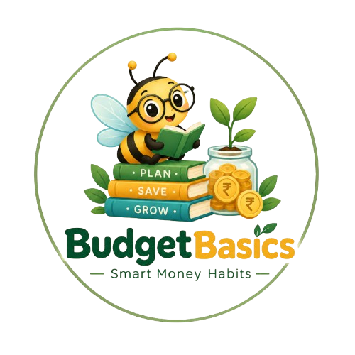

# 💰 BudgetBasics — Learn • Plan • Save

> **BudgetBasics** is a student-friendly educational website for learning personal budgeting — understand where your money goes, plan your spending, and build better money habits, all in one interactive page.

<div align="center">
  
</div>

---

## 👥 Team

| | |
|---|---|
| **Team Name** | Warrior Coders |
| **Members** | Tehzeeb · Abdullah · Muhammad Maaz · Ahmed Raza · Hira Nisar |
| **Institute** | Aptech Site Center |
| **Category** | Web Innovation Unleashed |

---

## 📖 About

BudgetBasics was built to solve a real problem identified in our SRS: most students graduate without ever learning how to budget, save, or spend responsibly. The site teaches budgeting fundamentals through simple explanations, interactive tools, and visual aids — no finance background needed. It is designed for students and young learners who want to understand needs vs wants, the 50-30-20 rule, savings planning, and everyday money mistakes in a simple, approachable way.

---

## ✨ Features

- 🧾 **Budgeting Basics** — Core concepts of budgeting explained in simple language
- ⚖️ **Needs vs Wants** — Interactive quiz-style game to classify everyday items
- 🧮 **50-30-20 Calculator** — Instantly split any income into Needs, Wants, and Savings
- 🎯 **Savings Goals** — Calculate how long until you reach a savings target
- 📋 **Expense Planner** — Add, view, and clear expenses with budget tracking and summary
- ⚠️ **Money Mistakes** — Common budgeting pitfalls and how to avoid them
- 📊 **Infographics** — Visual money tips with scrolling infographic cards
- 🔍 **Search** — Search across all site topics and jump straight to a section
- 🐝 **BudgetBee Assistant** — Rule-based chatbot available as a floating helper and inline section, answering common budgeting questions
- 🌙 **Dark Mode** — Toggle between light and dark themes
- 🎬 **AOS Animations** — Smooth scroll-based reveal animations
- 📱 **Responsive Design** — Fully responsive layout for mobile, tablet, and desktop

---

## 🛠️ Tech Stack

| Layer | Technology |
|---|---|
| Structure | **HTML5** |
| Styling | **CSS3** |
| Logic | **Vanilla JavaScript** (no frameworks) |
| Data | **JSON** (topics, quiz, tips, chatbot replies, etc.) |
| Icons | **Font Awesome** |
| Animations | **AOS (Animate On Scroll)** |
| Backend | *None — fully client-side* |

---

## 📁 Folder Structure

```
BudgetBasics/
│
├── index.html               # Single-page application (all sections)
│
├── css/
│   └── style.css            # All styling (light + dark mode, responsive)
│
├── js/
│   └── script.js            # All logic (tools, quiz, chatbot, dark mode)
│
├── data/
│   ├── topics.json          # Budgeting basics content
│   ├── classify.json        # Needs vs Wants game items
│   ├── quiz.json            # Budget quiz questions & messages
│   ├── tips.json            # Money tips
│   ├── savingTips.json      # Savings tips
│   ├── mistakes.json        # Common money mistakes
│   ├── expenseCategories.json
│   ├── chatbot.json         # BudgetBee chatbot replies
│   └── sitemap.json         # Navigation/sitemap data
│
├── image/
│   └── logo.png
```

---

## 🚀 How to Run Locally

> ⚠️ **Important:** The site loads its content with JavaScript `fetch()`, which browsers block on `file://` URLs (CORS restriction). You **must** run it through a local server — simply double-clicking `index.html` will not work.

### Option 1 — VS Code Live Server (easiest)

1. Open the project folder in **VS Code**
2. Install the **Live Server** extension (by Ritwick Dey) from the Extensions marketplace
3. Right-click `index.html` → **"Open with Live Server"**
4. Your browser opens automatically at `http://127.0.0.1:5500`

### Option 2 — Python HTTP Server

1. Open a terminal in the project root (the folder containing `index.html`)
2. Run:

   ```bash
   python -m http.server 8000
   ```

3. Open your browser and go to:

   ```
   http://localhost:8000
   ```

> Use `python3 -m http.server 8000` if `python` isn't recognized on your system.

---

## 🌐 Live Demo

> 🔗 **Live URL:** `<!-- Add your GitHub Pages URL here after hosting -->`

Once deployed, the demo will be available at:
`https://<your-username>.github.io/BudgetBasics/`

---

## 📌 Assumptions

As documented in the project SRS:

- Currency values shown in examples (e.g., **Rs.**) are **sample/demo values** for learning purposes only
- All expense and user data is **session-only** — nothing is stored on a server (localStorage only)
- The **BudgetBee Assistant is rule-based**, not AI — it matches keywords and returns predefined replies from `chatbot.json`
- Feedback and contact forms **do not transmit data** anywhere — submission is simulated client-side
- The site targets **modern browsers** (Chrome, Edge, Firefox) and does not support legacy browsers like Internet Explorer

---

## 🙏 Acknowledgements

In line with the SRS AI usage disclosure:

- **Claude (AI)** — Assisted with code generation, debugging, and documentation
- **Font Awesome** — Icon library used throughout the interface
- **AOS Library** — Scroll animation library powering the reveal effects

---

## 📄 License / Note

> ⚠️ This is an **educational project** built for learning purposes — it is **not a financial product** and does not provide professional financial advice.
